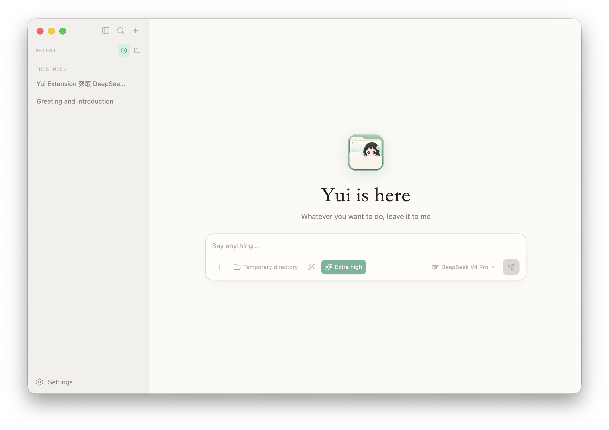

<p align="center">
  
</p>

# Yui

[English](README.md)

Yui 是一个本地优先、可自定义扩展、住在你电脑里的私人助手。在安静的桌面窗口里和她聊天，她可以帮你把事情都处理好。

<p align="center">
  
</p>

## 愿景

Yui 想成为“人人都能塑造了解自己的助手”的项目——伴随着时间沉淀，成为真正属于你的，懂你的那一个助手。
我们正在朝着这个方向前进：

- **一句话就能造出新能力**：描述一件你希望她能做的事——“在 Desktop 页面中显示我的 API 余额” —— Yui 就为你写好扩展，不需要自己编写扩展代码。
- **一份让她越来越懂你的记忆**：她会记住你的偏好、你的项目和那些小事，在一次次对话中越来越个人化，越来越像“你的”助手。
- **她是一个存在，而不只是一个窗口**：Yui 会有心情和表情，还有一个住在你屏幕上的桌宠——让 Yui 感觉像一个陪着你的人，而不是用完就关的工具。
- **真正本地、真正属于你**：没有账号、不绑定云端；你的数据、你们的回忆和你的助手，都跟着你。

## 试用

> 早期开发版，未签名也未公证，可能会有粗糙的地方。

**macOS**：从 [Releases 页面](https://github.com/ACAne0320/Yui/releases) 下载最新的 `.dmg`。由于尚未签名，macOS 会将其隔离并拦截首次启动。执行以下命令移除隔离标记即可消除 Gatekeeper 提示：

```bash
xattr -dr com.apple.quarantine /Applications/Yui.app
```

**从源码运行**（任意平台）：需要 Node.js 22.12+ 和 pnpm：

```bash
pnpm install
pnpm desktop:dev
```

她的配置目录默认在 `~/.yui`（可用 `YUI_HOME` 指向其他文件夹）。

## 致谢

Yui 站在 [Pi](https://github.com/earendil-works/pi) 的肩膀上。
底层由 Pi 静静驱动着她的对话、工具和扩展。特别感谢你们打造了如此强大、可嵌入的基础！

## License

[MIT](LICENSE) © 2026 ACAne0320
